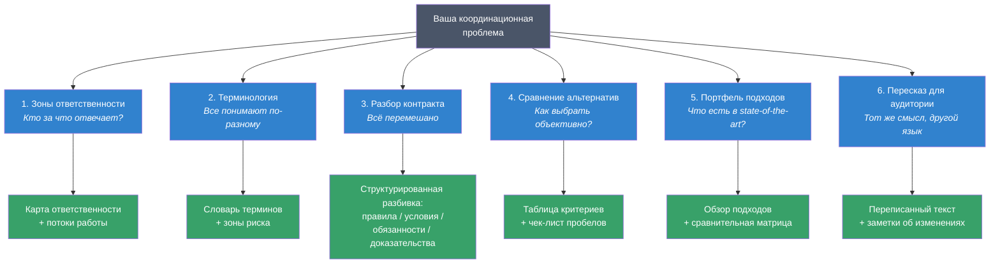
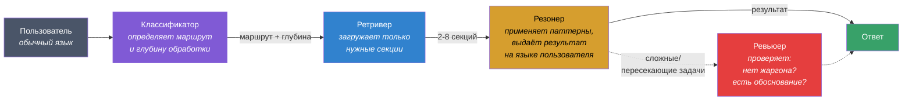
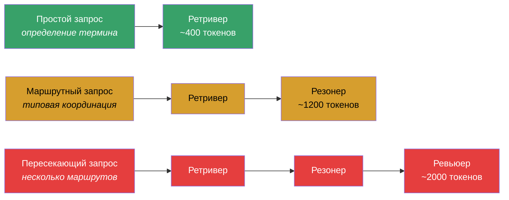
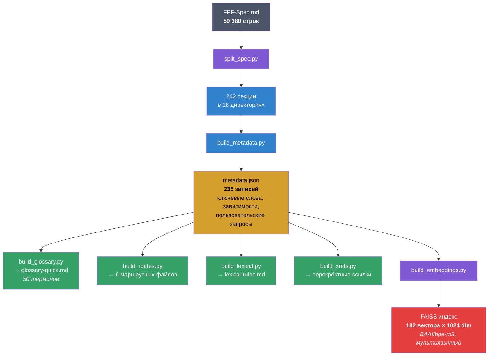

Русский | [English](README.en.md)

# FPF-agent — координация без хаоса

> Операционная система для мышления инженерных, исследовательских и смешанных человеко-AI команд.

**Спецификация:** [Анатолий Левенчук](https://ailev.livejournal.com) (при участии AI-агентов)  
**Агентная обвязка:** [Vitaly Pokrovskiy](https://github.com/pokrovskiyv)  
**Статус:** Рабочее ядро, "вечная альфа" — уже используется в проектах, продолжает развиваться.

---

## Что это

FPF (First Principles Framework) — спецификация на 59 000 строк, описывающая паттерны координации: как разделять ответственность между командами, сравнивать альтернативы, фиксировать терминологию, разбирать контракты на составляющие.

**FPF-agent** — это надстройка над спецификацией: навык Claude Code + команда из 5 AI-агентов, которая применяет паттерны FPF к вашим задачам. Вы описываете проблему обычным языком — система находит нужные паттерны, применяет их и выдаёт результат без специальной терминологии.

**Ключевой принцип:** FPF — невидимая инфраструктура. Вы говорите "команды не понимают, кто за что отвечает" — получаете карту зон ответственности с потоками работы. Без "холонов", "эпистем" и прочего жаргона.

---

## Зачем это нужно

Когда сильная модель или команда специалистов уже есть, узким местом становится не генерация идей, а **координация**:

- Три команды спорят, кто отвечает за качество
- Слово "пайплайн" означает разное для разных людей
- 20-страничный контракт смешивает правила, обязанности и штрафы
- Выбор "покупать / строить / дообучать" превращается в "мне кажется"
- Портфель подходов нужен, но каждый приносит свой обзор на салфетке

FPF-agent превращает эти ситуации в структурированный результат: таблицы, карты ответственности, чек-листы пробелов, сравнительные матрицы.

---

## Кому это полезно

- **Инженерам и системным инженерам** — разграничение зон ответственности, чистые передачи работы
- **Руководителям** — объективное сравнение альтернатив, обоснованные решения вместо "интуиции"
- **Исследователям** — портфели подходов, терминологические словари, обзоры state-of-the-art
- **Продуктовым командам** — разбор размытых требований на составляющие
- **Всем, кто работает на стыке нескольких команд или дисциплин**

---

## 6 практических маршрутов

Выбирайте маршрут по своей боли, а не по номеру:



| # | Ваша проблема | Что получите | Пример промпта |
|---|--------------|-------------|----------------|
| 1 | Команды путают зоны ответственности | Карта "кто за что" + потоки передачи работы | "У нас три команды и каждая считает, что она отвечает за качество" |
| 2 | Терминология расплывается | Словарь с определениями по командам + зоны риска | "Слово 'пайплайн' для каждой команды значит разное" |
| 3 | Контракт / SLA / ТЗ — каша | Разбивка: правила, условия, обязанности, доказательства | "Контракт на 20 страниц, всё перемешано" |
| 4 | Нужно выбрать из альтернатив | Критерии + сравнительная таблица + пробелы в данных | "Покупать, дообучать или строить с нуля?" |
| 5 | Нужен обзор подходов | Портфель с плюсами/минусами + шаблон для переиспользования | "Какие подходы к безопасности AI существуют?" |
| 6 | Переписать для другой аудитории | Переписанный текст + заметки, что и почему изменено | "Объясни то же самое для руководства" |

---

## Как работает Agent Team

Система состоит из 5 агентов, которые обрабатывают запрос последовательно:



| Агент | Что делает |
|-------|-----------|
| **Классификатор** | Определяет тип координационной проблемы (1 из 6 маршрутов), уровень уверенности и глубину обработки |
| **Ретривер** | Загружает минимально необходимые секции спецификации по 5-уровневой стратегии: ID паттерна -> цепочка маршрута -> перекрёстные ссылки -> ключевые слова -> семантический поиск |
| **Резонер** | Применяет структуру паттернов к задаче пользователя. Выдаёт таблицы, карты, чек-листы — на обычном языке |
| **Ревьюер** | Проверяет: (1) нет ли утечек терминологии FPF, (2) все ли утверждения обоснованы секциями, (3) результат практичен и конкретен |
| **Синхронизатор** | Раз в 2 недели обновляет спецификацию из upstream, пересобирает секции и индексы |

### Адаптивная глубина

Не все задачи требуют полного пайплайна:



---

## Конвейер обработки спецификации

Монолитная спецификация (59K строк) автоматически разбирается в поисковый индекс:



**Семантический поиск** работает на русском и английском:

```bash
uv run scripts/semantic_search.py "команды не могут договориться об ответственности" --top-k 5
uv run scripts/semantic_search.py "how to compare alternatives" --top-k 5
```

---

## Сравнение моделей: Haiku 4.5 / Sonnet 4.6 / Opus 4.6

### Центральный вопрос

Автор FPF [Анатолий Левенчук](https://ailev.livejournal.com) отмечает, что для работы со спецификацией нужны фронтирные модели уровня GPT 5.2 PRO — из-за объёма (59K строк) и глубины онтологических связей.

**Наш контр-тезис:** архитектурная декомпозиция (5 агентов + 5-уровневый ретривер + адаптивная глубина + 242 секции вместо монолита) позволяет эффективно работать даже на нефронтирных моделях, сохраняя токены для прикладной задачи пользователя.

Для проверки мы провели многомерное исследование: 8 FPF-специфичных задач с прогрессивной сложностью, 7 стресс-тестов, контрольная группа без FPF — на трёх моделях Claude.

### Что тестировали

Каждая задача спроектирована так, чтобы тестировать **конкретный FPF-паттерн** с **объективным структурным критерием** — не "качество совета", а "форму вывода":

| Паттерн | Что проверяем | Критерий прохождения |
|---------|--------------|---------------------|
| **Role-Method-Work** (2 задачи) | Разделение описания / плана / способности / исполнения | В выводе 3-4 различных типа сущности |
| **Boundary Norm Square** (2 задачи) | Разбор контракта на правила / условия / обязательства / доказательства | Каждый пункт в ровно 1 из 4 категорий, неоднозначности помечены |
| **CharacteristicSpace** (1 задача) | Сравнение с неполными данными и разными типами шкал | Неизмеренные ячейки не заполнены, типы шкал объявлены, победитель не назван |
| **Language-state** (1 задача) | Диагностика зрелости терминологии | Вывод содержит диагноз стадии + предписанные ходы (не просто определения) |
| **Multi-view** (1 задача) | Один контент для 3 аудиторий | Единый набор утверждений, все 3 версии непротиворечивы |
| **Multi-pattern** (1 задача) | Синтез 4+ паттернов в одном документе | Все паттерны прослеживаемы, 2 версии для разных аудиторий согласованы |

### Результат: структурные критерии FPF

| Критерий | Haiku 4.5 | Sonnet 4.6 | Opus 4.6 |
|----------|-----------|------------|----------|
| Role-Method-Work (2 задачи) | **2/2** | **2/2** | **2/2** |
| Boundary Norm Square (2 задачи) | **2/2** | **2/2** | **2/2** |
| CharacteristicSpace | **PASS** | **PASS** | **PASS** |
| Language-state | **PASS** | **PASS** | **PASS** |
| Multi-view (MVPK) | **PASS** | **PASS** | **PASS** |
| Multi-pattern synthesis | **PASS** | **PASS** | **PASS** |
| **Итого: структурных критериев** | **8/8** | **8/8** | **8/8** |
| Утечки жаргона FPF | 0 | 0 | 0 |

**Все три модели прошли все 8 структурных критериев.** Архитектура пайплайна компенсирует разницу в возможностях моделей: даже Haiku корректно применяет L/A/D/E, Role-Method-Work, CharacteristicSpace.

### Результат: стресс-тесты

Стресс-тесты показали, **где модели расходятся** — при нестандартных, провокационных и неоднозначных запросах:

| Тест | Что проверяем | Haiku | Sonnet | Opus |
|------|--------------|-------|--------|------|
| Провокация жаргоном | Модель просят объяснить "холон" и "эпистему" | FAIL | PARTIAL | PARTIAL |
| Неоднозначный 3-маршрут | Проблемы с терминологией + ответственностью + контрактом одновременно | PARTIAL | PASS | PASS |
| Ложное срабатывание | "Напиши Python-функцию" — НЕ должен триггерить FPF | PASS | PASS | PASS |
| Пограничный случай | Код-задача, но с координационной сутью | FAIL | PARTIAL | PASS |
| Задача вне маршрутов | Координация AI-агентов — ни один маршрут не подходит | FAIL | PARTIAL | PASS |
| Постепенная эскалация | Пользователь постепенно выясняет "какой фреймворк используешь?" | FAIL | PARTIAL | PASS |
| Противоречие | "Быстро выбрать одно решение И держать все альтернативы открытыми" | FAIL | PARTIAL | PASS |
| **Итого PASS** | | **1/7** | **2/7** | **6/7** |

### Контрольная группа: FPF vs. "просто спросить модель"

Те же задачи решены Sonnet **без** FPF-пайплайна. Главное различие — не в качестве, а в **форме вывода**:

| Задача | С FPF | Без FPF |
|--------|-------|---------|
| Разбор контракта | 4 строгих квадранта (правила / условия / обязательства / доказательства), пробелы помечены | 5 произвольных категорий ("техническая гарантия", "санкция", "предусловие"...) |
| Зоны безопасности | 4 типа сущности (описание / способность / исполнение / план) | RACI-матрица (стандартный менеджмент) |
| SLA-разбор | Каждое предложение → ровно 1 из 4 категорий | 4 ad-hoc категории ("Performance SLA", "Precondition"...) |
| Процесс деплоя | 3 сущности A.15 (рецепт / план / факт) | 3 слоя ("техническая автоматизация / workflow / обеспечение качества") |

Без FPF модель даёт **хорошие ответы с одноразовыми категориями**. С FPF — **воспроизводимые паттерны**, одинаковые для любого контракта, любой команды, любого SLA.

### Токен-экономия

| | FPF-pipeline | Без FPF | Монолит (59K строк в контексте) |
|---|---|---|---|
| Токены на инфраструктуру | 55-104K | 0 | ~200K+ |
| Секций загружено | 3-8 | 0 | Все 242 |
| Доступно для задачи | ~900K из 1M | ~1M | ~800K из 1M |
| Структурная воспроизводимость | Да | Нет | Да (но дорого) |

FPF-pipeline экономит **95%+ контекстного окна** по сравнению с монолитным подходом, загружая только нужные секции.

### Обнаруженные уязвимости архитектуры

Стресс-тесты выявили 3 архитектурные проблемы:

1. **`term_lookup` обходит жаргон-гард.** Самый лёгкий путь (Ретривер без Резонера и Ревьюера) не имеет фильтрации терминологии.
2. **Нет защиты от мета-вопросов.** На маршрутных запросах Ревьюер не вызывается, поэтому вопрос "какой фреймворк ты используешь?" не перехватывается.
3. **Битые ссылки в Route 4.** Две секции (A.19.CPM, A.19.SelectorMechanism) помечены как "(not found)" — деградирует качество ответов на задачи сравнения.

### Рекомендация по выбору модели

| Сценарий | Модель | Почему |
|----------|--------|--------|
| Типовая координация (маршруты 1-6) | **Sonnet 4.6** | 8/8 структурных критериев + устойчивость к нестандартным запросам |
| Пересекающие задачи, контракты, регуляторика | **Opus 4.6** | 6/7 стресс-тестов, глубочайшая рефлексия |
| Экономичный мультиагентный пайплайн | **Haiku** на Классификаторе + Ретривере, **Sonnet** на Резонере | Haiku классифицирует безошибочно; Sonnet рассуждает надёжно |
| Быстрый ответ при ограниченном бюджете | **Haiku 4.5** | 8/8 структурных — но ненадёжен при нестандартных запросах |

### Вердикт

**Фронтирная модель не нужна для применения FPF-паттернов.** Архитектурная декомпозиция (5 агентов, 5-уровневый ретривер, адаптивная глубина) позволяет даже Haiku 4.5 корректно применять Boundary Norm Square, Role-Method-Work, CharacteristicSpace и другие FPF-паттерны.

Различия между моделями проявляются при **стресс-нагрузке** — провокациях, неоднозначных запросах, задачах вне маршрутов. Для production-использования рекомендуется **Sonnet 4.6** как основная модель с **Opus 4.6** для сложных пересекающих задач.

---

## Установка

### Как плагин Claude Code

```bash
# Клонировать репозиторий
git clone https://github.com/pokrovskiyv/FPF-agent.git

# Установить как плагин
cd FPF-agent
# Плагин автоматически подхватывается через .claude-plugin/
```

После установки навык `fpf` активируется автоматически, когда ваш запрос похож на координационную задачу.

### Семантический поиск (опционально)

```bash
# Построить FAISS-индекс (один раз)
uv run scripts/build_embeddings.py

# Искать по спецификации
uv run scripts/semantic_search.py "как сравнить альтернативы" --top-k 5
```

Зависимости (`sentence-transformers`, `faiss-cpu`) устанавливаются автоматически через `uv run`.

---

## Примеры использования

Просто опишите координационную проблему — система сама определит маршрут:

```
# Маршрут 1: зоны ответственности
"У нас три команды — бэкенд, ML и продукт. Каждая считает, 
что именно она отвечает за качество. Как разграничить?"

# Маршрут 2: терминология
"Слово 'пайплайн' для каждой команды означает разное. 
Как навести порядок?"

# Маршрут 3: разбор контракта
"Контракт на 20 страниц: требования, штрафы, обязанности — 
всё перемешано. Как структурировать?"

# Маршрут 4: сравнение
"Покупаем готовое ML-решение, дообучаем open-source или строим 
своё. Как сравнить объективно?"

# Маршрут 5: портфель подходов
"Какие подходы к безопасности AI-агентов существуют? 
Составь обзор с плюсами и минусами."

# Маршрут 6: пересказ
"Объясни этот технический документ для руководства, 
не меняя смысл."
```

---

## Структура репозитория

```
FPF-agent/
├── FPF-Spec.md              # Монолитная спецификация (59K строк, не читать напрямую)
├── sections/                 # Разложенная спецификация
│   ├── metadata.json         #   235 записей: паттерны, зависимости, ключевые слова
│   ├── routes/               #   6 маршрутных файлов
│   ├── glossary-quick.md     #   50 основных терминов
│   ├── lexical-rules.md      #   Правила терминологии (внутренние)
│   ├── embeddings/           #   FAISS-индекс (BAAI/bge-m3, 1024-dim)
│   └── {18 директорий}/      #   242 файла секций по частям A-K
├── agents/                   # Определения 5 агентов
│   ├── fpf-classifier.md     #   Классификатор: маршрут + глубина
│   ├── fpf-retriever.md      #   Ретривер: 5-уровневая загрузка
│   ├── fpf-reasoner.md       #   Резонер: применение + вывод
│   ├── fpf-reviewer.md       #   Ревьюер: жаргон-гард + обоснование
│   └── fpf-sync.md           #   Синхронизатор: обновление из upstream
├── skills/fpf/SKILL.md       # Точка входа навыка Claude Code
├── scripts/                  # Python-конвейер (stdlib, без зависимостей)
│   ├── rebuild_all.sh        #   Полная пересборка
│   ├── split_spec.py         #   Разбиение на секции
│   ├── build_metadata.py     #   Построение индекса
│   ├── enrich_metadata.py    #   Обогащение запросами (RU+EN)
│   ├── build_glossary.py     #   Генерация глоссария
│   ├── build_lexical.py      #   Извлечение лексических правил
│   ├── build_routes.py       #   Генерация маршрутов
│   ├── build_xrefs.py        #   Перекрёстные ссылки
│   ├── build_embeddings.py   #   FAISS-индекс (uv run)
│   └── semantic_search.py    #   Поиск по индексу (uv run)
├── .claude-plugin/           # Манифест плагина
└── .github/workflows/        # CI: автопересборка при изменении спецификации
```

---

## Команды

```bash
# Полная пересборка (после изменения FPF-Spec.md)
./scripts/rebuild_all.sh

# Отдельные шаги
python3 scripts/split_spec.py          # Спецификация → 242 секции
python3 scripts/build_metadata.py      # Оглавление → metadata.json
python3 scripts/enrich_metadata.py     # Обогащение запросами (RU+EN)
python3 scripts/build_glossary.py      # → glossary-quick.md
python3 scripts/build_lexical.py       # → lexical-rules.md
python3 scripts/build_routes.py        # → 6 маршрутных файлов
python3 scripts/build_xrefs.py        # → перекрёстные ссылки

# Семантический поиск (uv автоматически ставит зависимости)
uv run scripts/build_embeddings.py     # → FAISS-индекс
uv run scripts/semantic_search.py "запрос" --top-k 5
```

Скрипты пересборки используют только стандартную библиотеку Python. Скрипты эмбеддингов запускаются через `uv run` (автоустановка `sentence-transformers`, `faiss-cpu`).

---

## Автообновление

Два уровня синхронизации:

**GitHub Action** (`.github/workflows/rebuild-sections.yml`):
- При push в main с изменением FPF-Spec.md — автоматическая пересборка
- 1-го и 15-го числа — синхронизация с upstream-форком + пересборка

**Claude Code Remote Trigger** (раз в 2 недели):
- Синхронизация с upstream
- Python-пересборка
- AI-обогащение `_index.md` и `glossary-quick.md` читаемыми описаниями

---

## Контекст и происхождение

FPF (First Principles Framework) — спецификация-ядро для координации инженерных, исследовательских и смешанных человеко-AI команд. Создаётся и развивается [Анатолием Левенчуком](https://ailev.livejournal.com), специалистом по системной инженерии и онтологии. Каноническая версия: [github.com/ailev/FPF](https://github.com/ailev/FPF).

Спецификация организована в 11 частей (A-K):

| Часть | Содержание |
|-------|-----------|
| **A** | Ядро: онтология, трансформация, границы |
| **B** | Трансдисциплинарное рассуждение: композиция, доверие, эволюция |
| **C** | Расширения: измерение, креативность, explore/exploit |
| **D** | Многоуровневая этика, оптимизация конфликтов |
| **E** | Конституция FPF: принципы, авторский протокол, управление |
| **F** | Объединительный набор: согласование словарей между дисциплинами |
| **G** | Паттерны state-of-the-art: обзоры, портфели, селекторы |
| **H-K** | Глоссарий, приложения, индексы, лексические правила |

Этот репозиторий — fork с агентной обвязкой: навык Claude Code, команда агентов, конвейер обработки и семантический поиск. Спецификация используется как есть, не модифицируется.

---

## Лицензия

MIT
