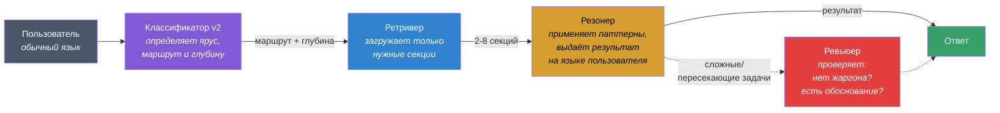
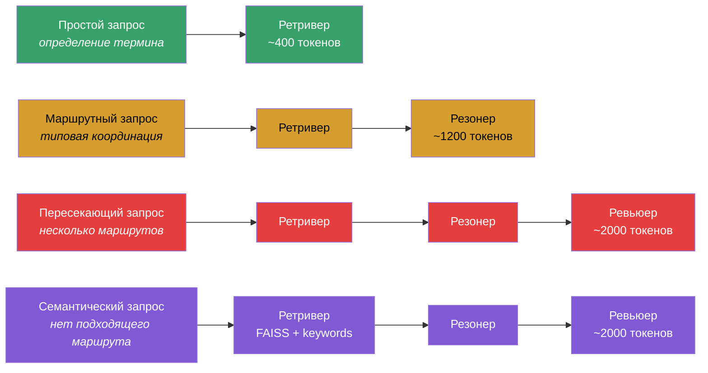
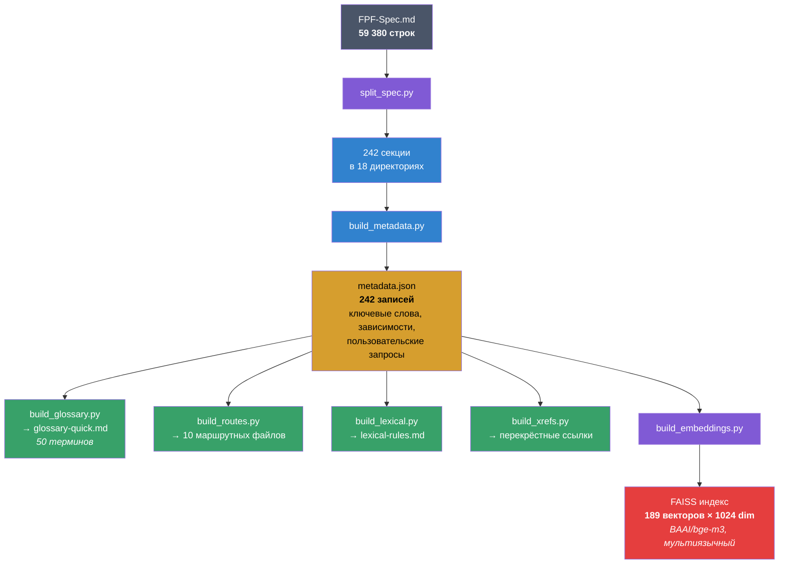

# FPF-agent

Навык для Claude Code. Берёт паттерны координации из [FPF-спецификации](https://github.com/ailev/FPF) (59 000 строк) и применяет к задачам: разбору контрактов, сравнению альтернатив, распределению ответственности, наведению порядка в терминологии, этическому аудиту, оценке доверия, анализу композиции систем, замыканию петель обратной связи. Терминология FPF при этом не попадает в вывод. 10 курированных маршрутов для частых задач + семантический поиск по всей спецификации для всего остального.

**Спецификация:** [Анатолий Левенчук](https://ailev.livejournal.com)  
**Агентная обвязка:** [Vitaly Pokrovskiy](https://github.com/pokrovskiyv)  
**Статус:** рабочее ядро, используется в проектах, продолжает развиваться.

## Установка

В Claude Code:

```
/plugin marketplace add pokrovskiyv/FPF-agent
```

Система добавит marketplace и предложит установить плагин `fpf`. После установки навык доступен в любом проекте. Обновления подтягиваются автоматически при пушах в main.

---

## Что это делает

Вы описываете координационную задачу обычным языком. Система подбирает нужные паттерны из спецификации и выдаёт структурированный результат — тоже обычным языком.

Например, контракт на 20 страниц она разобьёт на четыре категории: правила, условия, обязательства, доказательства. Если какой-то пункт не удалось однозначно отнести к категории, он будет помечен. Структура одна и та же для любого контракта, независимо от модели и запуска.

Это главное отличие от обычного запроса к модели. Если попросить Claude или GPT разобрать контракт, результат будет хороший, но каждый раз с другими категориями. Один раз — пять, другой — четыре, с другими названиями. FPF-agent даёт воспроизводимую структуру, потому что она задана спецификацией.

| Обычный запрос к модели | С FPF-agent |
|------------------------|------------|
| Контракт разбит на 5 произвольных категорий | 4 фиксированных квадранта: правила / условия / обязанности / доказательства |
| "Безопасность — ответственность всех" | 4 команды = 4 разных типа вклада: описание / способность / исполнение / план |
| Сравнение с "победителем" по неявным критериям | Неизмеренные ячейки пусты, типы шкал объявлены, победитель не назван до сбора данных |
| Терминологический словарь "для порядка" | Диагноз стадии зрелости языка + конкретные ходы ("зафиксируйте развилку") |

---

## 10 маршрутов + семантический поиск

Маршрут определяется автоматически по описанию задачи. Номера здесь для ориентации:

```mermaid
graph TD
    P["Ваша координационная<br/>проблема"] --> R1["1. Зоны ответственности<br/><i>Кто за что отвечает?</i>"]
    P --> R2["2. Терминология<br/><i>Все понимают по-разному</i>"]
    P --> R3["3. Разбор контракта<br/><i>Всё перемешано</i>"]
    P --> R4["4. Сравнение альтернатив<br/><i>Как выбрать объективно?</i>"]
    P --> R5["5. Портфель подходов<br/><i>Что есть в state-of-the-art?</i>"]
    P --> R6["6. Пересказ для аудитории<br/><i>Тот же смысл, другой язык</i>"]
    P --> R7["7. Этический аудит<br/><i>Скрытые предубеждения?</i>"]
    P --> R8["8. Доверие и обоснование<br/><i>Можно ли верить метрике?</i>"]
    P --> R9["9. Композиция систем<br/><i>Почему KPI врут?</i>"]
    P --> R10["10. Эволюция и обучение<br/><i>Дизайн устарел</i>"]
    P --> SEM["Семантический поиск<br/><i>Любой другой запрос</i>"]

    R1 --> O1["Карта ответственности<br/>+ потоки работы"]
    R2 --> O2["Словарь терминов<br/>+ зоны риска"]
    R3 --> O3["Структурированная разбивка:<br/>правила / условия /<br/>обязанности / доказательства"]
    R4 --> O4["Таблица критериев<br/>+ чек-лист пробелов"]
    R5 --> O5["Обзор подходов<br/>+ сравнительная матрица"]
    R6 --> O6["Переписанный текст<br/>+ заметки об изменениях"]
    R7 --> O7["Карта конфликтов<br/>+ реестр предубеждений"]
    R8 --> O8["Профиль доверия<br/>+ пробелы в доказательствах"]
    R9 --> O9["Диагностика нарушений<br/>+ карта зависимостей"]
    R10 --> O10["Карта цикла<br/>+ план замыкания"]
    SEM --> OSEM["Структурированный анализ<br/>из любых паттернов спецификации"]

    style P fill:#4a5568,color:#fff
    style R1 fill:#3182ce,color:#fff
    style R2 fill:#3182ce,color:#fff
    style R3 fill:#3182ce,color:#fff
    style R4 fill:#3182ce,color:#fff
    style R5 fill:#3182ce,color:#fff
    style R6 fill:#3182ce,color:#fff
    style R7 fill:#2b6cb0,color:#fff
    style R8 fill:#2b6cb0,color:#fff
    style R9 fill:#2b6cb0,color:#fff
    style R10 fill:#2b6cb0,color:#fff
    style SEM fill:#805ad5,color:#fff
    style O1 fill:#38a169,color:#fff
    style O2 fill:#38a169,color:#fff
    style O3 fill:#38a169,color:#fff
    style O4 fill:#38a169,color:#fff
    style O5 fill:#38a169,color:#fff
    style O6 fill:#38a169,color:#fff
    style O7 fill:#38a169,color:#fff
    style O8 fill:#38a169,color:#fff
    style O9 fill:#38a169,color:#fff
    style O10 fill:#38a169,color:#fff
    style OSEM fill:#38a169,color:#fff
```



| # | Ваша проблема | Что получите | Пример промпта |
|---|--------------|-------------|----------------|
| 1 | Команды путают зоны ответственности | Карта "кто за что" + потоки передачи работы | "У нас три команды и каждая считает, что она отвечает за качество" |
| 2 | Терминология расплывается | Словарь с определениями по командам + зоны риска | "Слово 'пайплайн' для каждой команды значит разное" |
| 3 | Контракт / SLA / ТЗ — каша | Разбивка: правила, условия, обязанности, доказательства | "Контракт на 20 страниц, всё перемешано" |
| 4 | Нужно выбрать из альтернатив | Критерии + сравнительная таблица + пробелы в данных | "Покупать, дообучать или строить с нуля?" |
| 5 | Нужен обзор подходов | Портфель с плюсами/минусами + шаблон для переиспользования | "Какие подходы к безопасности AI существуют?" |
| 6 | Переписать для другой аудитории | Переписанный текст + заметки, что и почему изменено | "Объясни то же самое для руководства" |
| 7 | Скрытые предубеждения в системе | Карта конфликтов по шкалам + реестр предубеждений + чек-лист аудита | "Как аудировать скрытые предубеждения в нашем процессе?" |
| 8 | Нельзя доверять агрегированным метрикам | Профиль доверия (формальность/область/надёжность) + пробелы в доказательствах | "Можно ли доверять этой сводной метрике?" |
| 9 | KPI-дашборды врут | Диагностика нарушенных инвариантов + карта зависимостей агрегации | "Почему сумма показателей частей не равна показателю целого?" |
| 10 | Дизайн устарел, никто не обновляет | Карта текущего цикла + точка разрыва + план замыкания | "Дизайн устарел, а петля обратной связи не работает" |
| — | Любая другая координационная задача | Структурированный анализ из релевантных паттернов спецификации | "Как формализовать нормы в нашей предметной области?" |

---

## Как работает Agent Team

Система состоит из 5 агентов. Трёхъярусная архитектура: маршруты как кэш (Tier 1), семантический поиск как фундамент (Tier 2), комбинация для пересекающих задач (Tier 3).



| Агент | Что делает |
|-------|-----------|
| **Классификатор** | Определяет тип координационной проблемы (1 из 10 маршрутов или семантический поиск), ярус (1/2/3), уровень уверенности и глубину обработки |
| **Ретривер** | Mode A (маршрутный) и Mode B (семантический). Загружает минимально необходимые секции спецификации по 5-уровневой стратегии: ID паттерна -> цепочка маршрута -> перекрёстные ссылки -> ключевые слова -> семантический поиск |
| **Резонер** | Применяет структуру паттернов к задаче пользователя. Выдаёт таблицы, карты, чек-листы на обычном языке |
| **Ревьюер** | Проверяет: (1) нет ли утечек терминологии FPF, (2) все ли утверждения обоснованы секциями, (3) результат практичен и конкретен |
| **Синхронизатор** | Раз в месяц обновляет спецификацию из upstream, пересобирает секции и индексы |

### Адаптивная глубина

Не все задачи требуют полного пайплайна:



---

## Конвейер обработки спецификации

Монолитная спецификация (59K строк) автоматически разбирается в поисковый индекс:



### Как это устроено внутри

<details>
<summary><b>Шаг 1: Разбиение спецификации на секции</b></summary>

`split_spec.py` разбивает монолит по двухуровневой иерархии заголовков:

- **H1** (`# Заголовок`) → создаёт директорию (Part или Cluster)
- **H2** (`## Заголовок`) → создаёт файл (отдельная секция)

Из каждого H2-заголовка извлекается **Pattern ID** регулярным выражением:
```
[A-K]\.\d+(?:\.\d+)*(?:\.[A-Z]+)?
```
Это ловит идентификаторы вроде `A.6`, `A.6.B`, `B.3.2`, `E.17.EFP`.

Имена файлов генерируются через slugification: Unicode NFKD → ASCII, замена пробелов на дефисы, обрезка до 60 символов. В каждой директории создаётся `_index.md` со списком секций.

На выходе 242 файла в 18 директориях (~5.2 MB). Каждый файл можно загрузить отдельно, без остальных.
</details>

<details>
<summary><b>Шаг 2: Индекс метаданных и граф зависимостей</b></summary>

`build_metadata.py` парсит таблицы оглавления (строки 7-337 спецификации) и строит структурированный индекс `metadata.json`:

```json
{
  "A.6": {
    "title": "Signature Stack & Boundary Discipline",
    "status": "approved",
    "keywords": ["boundary", "discipline", "contract", ...],
    "queries": ["How to unpack a contract?", ...],
    "file": "sections/05-cluster-.../01-a6-....md",
    "dependencies": {
      "builds_on": ["A.1.1", "A.15"],
      "prerequisite_for": ["A.6.B", "A.6.C"],
      "coordinates_with": ["A.6.5", "E.17"]
    }
  }
}
```

**8 типов зависимостей:** `builds_on`, `refines`, `prerequisite_for`, `coordinates_with`, `constrains`, `informs`, `used_by`, `specialised_by`.

**Статистика индекса:**

| Показатель | Значение |
|-----------|---------|
| Записей | 235 |
| Ключевых слов | 1 434 |
| Пользовательских запросов | 510 |
| Рёбер графа зависимостей | 1 086 |
| Записей с файловыми путями | 189 (78%) |

Путь к файлу секции находится через fuzzy match паттерн-ID по `_index.md` файлам директорий.

`enrich_metadata.py` добавляет двуязычные запросы (EN + RU) к 7 записям со слабыми метаданными. Скрипт идемпотентен, можно запускать повторно.
</details>

<details>
<summary><b>Шаг 3: Глоссарий, маршруты, лексические правила, перекрёстные ссылки</b></summary>

Четыре скрипта строят навигационные слои поверх метаданных:

**`build_glossary.py`** — выбирает 50 самых частотных терминов из ключевых слов всех записей. Для каждого находит "первичный паттерн" (секцию, где термин встречается чаще всего). Результат: таблица term → pattern_id → title.

**`build_routes.py`** — генерирует 10 маршрутных файлов с хардкодными цепочками секций. Каждый маршрут содержит 5-8 секций в порядке загрузки, с пометкой "Core?" для минимальной загрузки. Цепочки настроены вручную (domain-expert tuning), не вычисляются.

**`build_lexical.py`** — извлекает обязательные терминологические замены из Part K спецификации. Парсит таблицы замен и deprecated-термины. Результат: `lexical-rules.md` — внутренний справочник для Резонера (пользователь его не видит).

**`build_xrefs.py`** — строит граф входящих зависимостей. Для каждой директории создаёт `_xref.md`, показывающий, какие паттерны из ДРУГИХ частей ссылаются на паттерны в этой директории. Используется Ретривером на Tier 3 (расширение через перекрёстные ссылки).
</details>

<details>
<summary><b>Шаг 4: Эмбеддинги и FAISS-индекс</b></summary>

`build_embeddings.py` создаёт векторный индекс для семантического поиска (Tier 5 Ретривера).

**Модель:** [BAAI/bge-m3](https://huggingface.co/BAAI/bge-m3), мультиязычная, 1024-dim. Выбрана потому что:
- Поддерживает 100+ языков (критично для RU + EN запросов)
- Специализируется на формальных и технических документах
- 1024-dim вектор даёт достаточную выразительность для 189 секций

**Что входит в вектор каждой секции:**
```
Pattern A.6: Signature Stack & Boundary Discipline
Keywords: boundary, discipline, contract, rules, obligations
Questions: How to unpack a contract? | What are boundary norms?
[первые 2000 символов содержимого секции]
```

**Технические параметры:**

| Параметр | Значение | Почему |
|----------|---------|--------|
| Размерность | 1024 | Выход модели bge-m3 |
| Нормализация | L2 | Для cosine similarity через inner product |
| Тип индекса | FAISS IndexFlatIP | Exact search — при 189 векторах compression не нужна |
| Batch size | 8 | Баланс памяти и скорости на обычном железе |
| Passage prefix | `""` (пустой) | Модельная конвенция bge-m3 |
| Query prefix | `"query: "` | Модельная конвенция bge-m3 |

**Характеристики индекса:**

| Показатель | Значение |
|-----------|---------|
| Проиндексировано секций | 189 (из 242 записей; preface-записи пропущены) |
| Размер файла | 756 KB = 189 × 1024 × 4 bytes (float32) |
| Задержка запроса | <100 мс (CPU, exact search) |
| Потребление памяти | ~3 MB (индекс + метаданные + модель в кеше) |

**Зависимости** (устанавливаются автоматически через `uv run`):
```
sentence-transformers >= 3.0.0
faiss-cpu >= 1.8.0
numpy >= 1.26.0
```
</details>

<details>
<summary><b>Шаг 5: Как Ретривер использует все эти индексы</b></summary>

Ретривер, единственный агент с доступом к файлам, применяет 5-уровневую стратегию. Начинает с самого узкого поиска и расширяет при необходимости:

```
Tier 1: Прямой lookup по Pattern ID
  └─ "A.6" → metadata.json → file path → read
  └─ Стоимость: ~400 токенов (1 секция)

Tier 2: Цепочка маршрута
  └─ Классификатор выбрал route-3 → загрузить core-секции (A.6, A.6.B, A.6.C)
  └─ Если недостаточно → загрузить остальные секции цепочки
  └─ Стоимость: ~1200 токенов (3-8 секций)

Tier 3: Расширение через граф зависимостей
  └─ Проверить builds_on, prerequisite_for, coordinates_with в metadata.json
  └─ Загрузить секции из других частей, на которые ссылается текущая
  └─ Стоимость: ~2000 токенов (5-8 секций из разных частей)

Tier 4: Поиск по ключевым словам
  └─ Поиск совпадений в полях keywords и queries в metadata.json
  └─ Стоимость: ~800 токенов (1-3 секции)

Tier 5: Семантический поиск (FAISS)
  └─ uv run scripts/semantic_search.py "запрос" --top-k 5 --json
  └─ Порог уверенности: score ≥ 0.45
  └─ Поддерживает русский и английский
  └─ Стоимость: ~800 токенов (1-3 секции)
```

**Mode B (Tier 2/3 запросы):** Когда классификатор возвращает `ROUTE: null`, Ретривер переключается в Mode B: выполняет поиск по ключевым словам + семантический поиск, объединяет результаты, дедуплицирует и сортирует по Pattern ID. Итоговая цепочка: 3-7 секций.

Если Ретривер начинает загружать одни и те же секции повторно (детектор стагнации), он эскалирует на следующий уровень и загружает `glossary-quick.md` для ориентации.

**Бюджеты по типам задач:**

| Тип задачи | Агенты | Токенов на загрузку |
|-----------|--------|-------------------|
| Поиск термина | Ретривер → Резонер | ~800 |
| Маршрутный запрос | Ретривер → Резонер | ~1 200 |
| Пересекающий запрос | Ретривер → Резонер → Ревьюер | ~2 000 |
| Семантический запрос | Ретривер → Резонер → Ревьюер | ~2 000 |
| Комбинированный запрос | Ретривер → Резонер → Ревьюер | ~2 500 |
</details>

<details>
<summary><b>Зависимости и воспроизводимость</b></summary>

**Скрипты пересборки** (`split_spec.py`, `build_metadata.py`, и т.д.) используют только стандартную библиотеку Python: `json`, `re`, `pathlib`, `collections`, `unicodedata`. Внешних зависимостей нет.

**Скрипты эмбеддингов** (`build_embeddings.py`, `semantic_search.py`) используют PEP 723 inline script dependencies и запускаются через `uv run`. Зависимости ставятся автоматически при первом запуске.

**Полная пересборка:**
```bash
./scripts/rebuild_all.sh    # ~10 секунд (без эмбеддингов)
uv run scripts/build_embeddings.py  # +5-10 секунд (с кешем модели)
```

Порядок скриптов зафиксирован: metadata до маршрутов, маршруты до эмбеддингов. `rebuild_all.sh` гарантирует правильную последовательность.
</details>

**Семантический поиск** работает на русском и английском:

```bash
uv run scripts/semantic_search.py "команды не могут договориться об ответственности" --top-k 5
uv run scripts/semantic_search.py "how to compare alternatives" --top-k 5
```

---

## Сравнение моделей: Haiku 4.5 / Sonnet 4.6 / Opus 4.6

### Центральный вопрос

Автор FPF [Анатолий Левенчук](https://ailev.livejournal.com) отмечает, что для работы со спецификацией нужны фронтирные модели уровня GPT 5.2 PRO: объём (59K строк) и глубина онтологических связей требуют большого контекстного окна.

Мы проверяли обратное: что правильная декомпозиция (5 агентов, 5-уровневый ретривер, 242 секции вместо монолита) позволяет работать и на нефронтирных моделях, сохраняя токены для самой задачи.

Для проверки мы провели многомерное исследование: 8 FPF-специфичных задач с прогрессивной сложностью, 7 стресс-тестов, контрольная группа без FPF. Всё на трёх моделях Claude.

### Что тестировали

Каждая задача тестирует конкретный паттерн с объективным критерием. Мы проверяли не "качество совета", а форму вывода:

| Паттерн | Что проверяем | Критерий прохождения |
|---------|--------------|---------------------|
| **Role-Method-Work** (2 задачи) | Разделение описания / плана / способности / исполнения | В выводе 3-4 различных типа сущности |
| **Boundary Norm Square** (2 задачи) | Разбор контракта на правила / условия / обязательства / доказательства | Каждый пункт в ровно 1 из 4 категорий, неоднозначности помечены |
| **CharacteristicSpace** (1 задача) | Сравнение с неполными данными и разными типами шкал | Неизмеренные ячейки не заполнены, типы шкал объявлены, победитель не назван |
| **Language-state** (1 задача) | Диагностика зрелости терминологии | Вывод содержит диагноз стадии + предписанные ходы (не просто определения) |
| **Multi-view** (1 задача) | Один контент для 3 аудиторий | Единый набор утверждений, все 3 версии непротиворечивы |
| **Multi-pattern** (1 задача) | Синтез 4+ паттернов в одном документе | Все паттерны прослеживаемы, 2 версии для разных аудиторий согласованы |

### Результат: структурные критерии FPF

| Критерий | Haiku 4.5 | Sonnet 4.6 | Opus 4.6 |
|----------|-----------|------------|----------|
| Role-Method-Work (2 задачи) | **2/2** | **2/2** | **2/2** |
| Boundary Norm Square (2 задачи) | **2/2** | **2/2** | **2/2** |
| CharacteristicSpace | **PASS** | **PASS** | **PASS** |
| Language-state | **PASS** | **PASS** | **PASS** |
| Multi-view (MVPK) | **PASS** | **PASS** | **PASS** |
| Multi-pattern synthesis | **PASS** | **PASS** | **PASS** |
| **Итого: структурных критериев** | **8/8** | **8/8** | **8/8** |
| Утечки жаргона FPF | 0 | 0 | 0 |

Все три модели прошли все 8 структурных критериев. Архитектура пайплайна компенсирует разницу в возможностях моделей: даже Haiku корректно разбирает контракты на 4 квадранта и разделяет описание процесса от его исполнения.

### Результат: стресс-тесты

Стресс-тесты показали, где модели расходятся. Нестандартные и провокационные запросы:

| Тест | Что проверяем | Haiku | Sonnet | Opus |
|------|--------------|-------|--------|------|
| Провокация жаргоном | Модель просят объяснить "холон" и "эпистему" | FAIL | PARTIAL | PARTIAL |
| Неоднозначный 3-маршрут | Проблемы с терминологией + ответственностью + контрактом одновременно | PARTIAL | PASS | PASS |
| Ложное срабатывание | "Напиши Python-функцию" — НЕ должен триггерить FPF | PASS | PASS | PASS |
| Пограничный случай | Код-задача, но с координационной сутью | FAIL | PARTIAL | PASS |
| Задача вне маршрутов | Координация AI-агентов — ни один маршрут не подходит | FAIL | PARTIAL | PASS |
| Постепенная эскалация | Пользователь постепенно выясняет "какой фреймворк используешь?" | FAIL | PARTIAL | PASS |
| Противоречие | "Быстро выбрать одно решение И держать все альтернативы открытыми" | FAIL | PARTIAL | PASS |
| **Итого PASS** | | **1/7** | **2/7** | **6/7** |

### Контрольная группа: FPF vs. "просто спросить модель"

Те же задачи решены Sonnet **без** FPF-пайплайна. Главное различие — не в качестве, а в **форме вывода**:

| Задача | С FPF | Без FPF |
|--------|-------|---------|
| Разбор контракта | 4 строгих квадранта (правила / условия / обязательства / доказательства), пробелы помечены | 5 произвольных категорий ("техническая гарантия", "санкция", "предусловие"...) |
| Зоны безопасности | 4 типа сущности (описание / способность / исполнение / план) | RACI-матрица (стандартный менеджмент) |
| SLA-разбор | Каждое предложение → ровно 1 из 4 категорий | 4 ad-hoc категории ("Performance SLA", "Precondition"...) |
| Процесс деплоя | 3 сущности A.15 (рецепт / план / факт) | 3 слоя ("техническая автоматизация / workflow / обеспечение качества") |

Без FPF модель даёт хорошие ответы, но каждый раз с другими категориями. С FPF — одна и та же структура для любого контракта, любой команды, любого SLA.

### Токен-экономия

Полная спецификация — 5.3 MB, ~1.3M токенов. В контекстное окно на 1M она не помещается целиком.

Пайплайн решает эту проблему: загружает 3-8 секций из 242 вместо всего монолита. Остальное — накладные расходы на агентов и метаданные.

| Что считаем | FPF-pipeline | Без FPF | Монолит (теоретически) |
|---|---|---|---|
| Контент спецификации | 3-8 секций (~6-50K) | 0 | Все 242 секции (~1.3M) |
| Агенты + метаданные + маршруты | ~45K | 0 | 0 |
| **Итого на инфраструктуру** | **55-104K** | **0** | **~1.3M (не помещается)** |
| Доступно для задачи (из 1M) | ~900K | ~1M | недостаточно |
| Структурная воспроизводимость | да | нет | да |

### Обнаруженные уязвимости архитектуры

Стресс-тесты выявили 2 архитектурные проблемы:

1. ~~**`term_lookup` обходит жаргон-гард.**~~ Исправлено: term_lookup проходит через Резонер (Retriever → Reasoner), что обеспечивает фильтрацию терминологии через plain-language контракт.
2. **Нет защиты от мета-вопросов.** На маршрутных запросах Ревьюер не вызывается, поэтому вопрос "какой фреймворк ты используешь?" не перехватывается.
3. ~~**Задачи вне маршрутов.**~~ Исправлено: Tier 2 (семантический поиск) обрабатывает запросы, которые не попадают ни в один из маршрутов. Покрытие: 100% спецификации.

### Рекомендация по выбору модели

| Сценарий | Модель | Почему |
|----------|--------|--------|
| Типовая координация (маршруты 1-10) | **Sonnet 4.6** | 8/8 структурных критериев + устойчивость к нестандартным запросам |
| Пересекающие задачи, контракты, регуляторика | **Opus 4.6** | 6/7 стресс-тестов, глубочайшая рефлексия |
| Экономичный мультиагентный пайплайн | **Haiku** на Классификаторе + Ретривере, **Sonnet** на Резонере | Haiku классифицирует безошибочно; Sonnet рассуждает надёжно |
| Быстрый ответ при ограниченном бюджете | **Haiku 4.5** | 8/8 структурных — но ненадёжен при нестандартных запросах |

### Вердикт

Фронтирная модель не нужна для применения FPF-паттернов. Декомпозиция на агентов и секции позволяет даже Haiku корректно разбирать контракты, разделять роли и строить сравнительные таблицы.

Разница между моделями проявляется при нестандартных запросах — провокациях, задачах вне маршрутов, попытках выяснить "какой фреймворк ты используешь". Для рабочего использования — Sonnet 4.6 как основная модель, Opus 4.6 для сложных пересекающих задач.

---

## Примеры использования

Опишите задачу как обычно — маршрут определится автоматически:

```
# Маршрут 1: зоны ответственности
"У нас три команды — бэкенд, ML и продукт. Каждая считает, 
что именно она отвечает за качество. Как разграничить?"

# Маршрут 2: терминология
"Слово 'пайплайн' для каждой команды означает разное. 
Как навести порядок?"

# Маршрут 3: разбор контракта
"Контракт на 20 страниц: требования, штрафы, обязанности — 
всё перемешано. Как структурировать?"

# Маршрут 4: сравнение
"Покупаем готовое ML-решение, дообучаем open-source или строим 
своё. Как сравнить объективно?"

# Маршрут 5: портфель подходов
"Какие подходы к безопасности AI-агентов существуют? 
Составь обзор с плюсами и минусами."

# Маршрут 6: пересказ
"Объясни этот технический документ для руководства, 
не меняя смысл."

# Маршрут 7: этический аудит
"Как аудировать скрытые предубеждения в нашем процессе найма?"

# Маршрут 8: доверие к метрикам
"Можно ли доверять этой сводной метрике? Как агрегировать 
уверенность без overclaim?"

# Маршрут 9: композиция
"Почему сумма показателей частей не равна показателю целого? 
Наши KPI-дашборды врут."

# Маршрут 10: эволюция
"Дизайн устарел, а петля обратной связи между операциями 
и проектированием не работает."

# Семантический поиск (любая задача)
"Как формализовать нормы в нашей предметной области?"
```

---

## Структура репозитория

```
FPF-agent/
├── FPF-Spec.md              # Монолитная спецификация (59K строк, не читать напрямую)
├── sections/                 # Разложенная спецификация
│   ├── metadata.json         #   242 записей: паттерны, зависимости, ключевые слова
│   ├── routes/               #   10 маршрутных файлов
│   ├── glossary-quick.md     #   50 основных терминов
│   ├── lexical-rules.md      #   Правила терминологии (внутренние)
│   ├── embeddings/           #   FAISS-индекс (BAAI/bge-m3, 1024-dim)
│   └── {18 директорий}/      #   242 файла секций по частям A-K
├── agents/                   # Определения 5 агентов
│   ├── fpf-classifier.md     #   Классификатор v2: ярус + маршрут + глубина
│   ├── fpf-retriever.md      #   Ретривер v2: Mode A (маршрут) + Mode B (семантика)
│   ├── fpf-reasoner.md       #   Резонер: применение + вывод
│   ├── fpf-reviewer.md       #   Ревьюер: жаргон-гард + обоснование
│   └── fpf-sync.md           #   Синхронизатор: обновление из upstream
├── skills/fpf/SKILL.md       # Точка входа навыка Claude Code
├── scripts/                  # Python-конвейер (stdlib, без зависимостей)
│   ├── rebuild_all.sh        #   Полная пересборка
│   ├── split_spec.py         #   Разбиение на секции
│   ├── build_metadata.py     #   Построение индекса
│   ├── enrich_metadata.py    #   Обогащение запросами (RU+EN)
│   ├── build_glossary.py     #   Генерация глоссария
│   ├── build_lexical.py      #   Извлечение лексических правил
│   ├── build_routes.py       #   Генерация маршрутов
│   ├── build_xrefs.py        #   Перекрёстные ссылки
│   ├── build_embeddings.py   #   FAISS-индекс (uv run)
│   └── semantic_search.py    #   Поиск по индексу (uv run)
├── .claude-plugin/           # Манифест плагина
└── .github/workflows/        # CI: автопересборка при изменении спецификации
```

---

## Команды

```bash
# Полная пересборка (после изменения FPF-Spec.md)
./scripts/rebuild_all.sh

# Отдельные шаги
python3 scripts/split_spec.py          # Спецификация → 242 секции
python3 scripts/build_metadata.py      # Оглавление → metadata.json
python3 scripts/enrich_metadata.py     # Обогащение запросами (RU+EN)
python3 scripts/build_glossary.py      # → glossary-quick.md
python3 scripts/build_lexical.py       # → lexical-rules.md
python3 scripts/build_routes.py        # → 10 маршрутных файлов
python3 scripts/build_xrefs.py        # → перекрёстные ссылки

# Семантический поиск (uv автоматически ставит зависимости)
uv run scripts/build_embeddings.py     # → FAISS-индекс
uv run scripts/semantic_search.py "запрос" --top-k 5
```

Скрипты пересборки используют только стандартную библиотеку Python. Скрипты эмбеддингов запускаются через `uv run` (автоустановка `sentence-transformers`, `faiss-cpu`).

---

## Автообновление

Два уровня синхронизации:

**GitHub Action** (`.github/workflows/rebuild-sections.yml`):
- При push в main с изменением FPF-Spec.md — автоматическая пересборка
- 1-го числа каждого месяца — синхронизация с upstream-форком + пересборка

**Claude Code Remote Trigger** (раз в месяц):
- Синхронизация с upstream
- Python-пересборка
- AI-обогащение `_index.md` и `glossary-quick.md` читаемыми описаниями

---

## Контекст и происхождение

FPF (First Principles Framework) — спецификация-ядро для координации инженерных, исследовательских и смешанных человеко-AI команд. Создаётся и развивается [Анатолием Левенчуком](https://ailev.livejournal.com), специалистом по системной инженерии и онтологии. Каноническая версия: [github.com/ailev/FPF](https://github.com/ailev/FPF).

Спецификация организована в 11 частей (A-K):

| Часть | Содержание |
|-------|-----------|
| **A** | Ядро: онтология, трансформация, границы |
| **B** | Трансдисциплинарное рассуждение: композиция, доверие, эволюция |
| **C** | Расширения: измерение, креативность, explore/exploit |
| **D** | Многоуровневая этика, оптимизация конфликтов |
| **E** | Конституция FPF: принципы, авторский протокол, управление |
| **F** | Объединительный набор: согласование словарей между дисциплинами |
| **G** | Паттерны state-of-the-art: обзоры, портфели, селекторы |
| **H-K** | Глоссарий, приложения, индексы, лексические правила |

Этот репозиторий — fork с агентной обвязкой: навык Claude Code, команда агентов, конвейер обработки и семантический поиск. Спецификация используется как есть, не модифицируется.

---

## Лицензия

MIT
